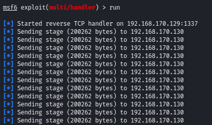

##  Windows/x64 - Inject All Processes with Meterpreter Reverse Shell (655 Bytes)
### Shellcode Author: Bobby Cooke (boku)
### Date:             May 1st, 2021
### Tested on:        Windows 10 v2004 (x64)
### Compiled from:    Kali Linux (x86_64)

## Shellcode Description:
+ 64bit Windows 10 shellcode that injects all processes with Meterpreter reverse shells. The shellcode first resolves the base address of kernel32.dll dynamically in memory via the Intel GS Register & host processes Process Environment Block (PEB). Then resolves the addresses  for the OpenProcess, VirtualAllocEx, WriteProcessMemory, and CreateRemoteThread APIs via kernel32.dll's Export Table. Once all API's are resolved the shellcode then attempts to open a handle to other processes using the OpenProcess API via bruteforcing the PIDs. When a handle to a remote process is returned, the shellcode then attempts to allocate writable & executable memory in the remote process using the VirtualAllocEx API. If successful, the shellcode will then use the WriteProcessMemory API to write the Meterpreter shellcode into the memory of the remote process. To this point, if everything has returned sucessful, then the CreateRemoteThread API will be executed to create a thread in the remote process that will run the Meterpreter shell within that remote process. The shellcode then continues to bruteforce through more PIDs to launch more Meterpreter shells. 
